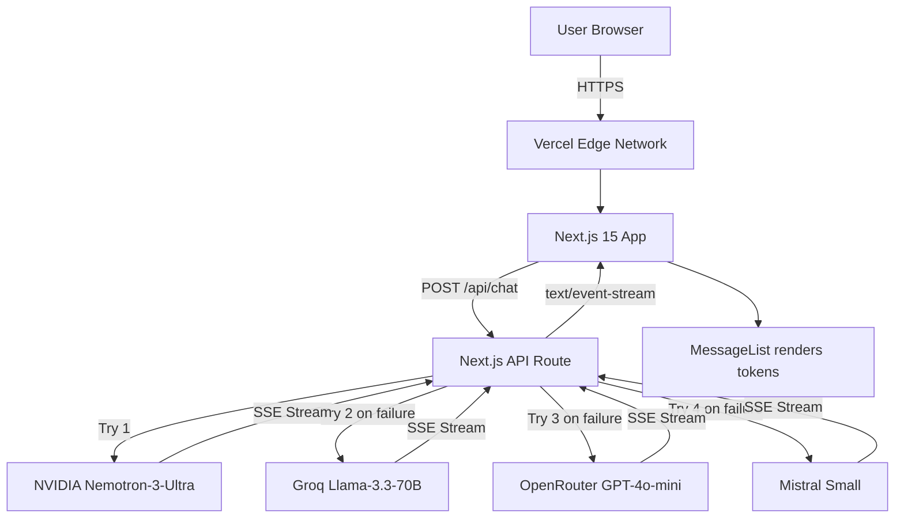

---

<div align="center">

[COLLEGE LOGO PLACEHOLDER — Insert before printing]

<br/><br/>

# PROJECT REPORT

## on

# KIRAN — AI HELPLINE CHATBOT

### "Because every child is Special"

<br/>

Submitted in partial fulfilment of the requirements for the  
**B.Tech in Computer Science Engineering (Specialization in Artificial Intelligence)**

<br/><br/>

**Submitted by:**  
**Shravan Kumar Deb**  
**Roll No: [YOUR ROLL NUMBER]**  
**3rd Semester, Academic Year 2025–26**

<br/><br/>

**Under the Guidance of:**  
**Self-Directed Project**

<br/><br/>

**Department of Computer Science Engineering**  
**[YOUR COLLEGE NAME]**  
**[COLLEGE ADDRESS]**  
**2025**

</div>

---

## DECLARATION

I hereby declare that the project titled **"Kiran — AI Helpline Chatbot"** submitted to **[COLLEGE NAME]** is a record of original work done by me. This project was self-initiated and was not assigned as part of any academic curriculum or commissioned by any organization. The work contained in this report has not been submitted elsewhere for any examination or degree. All external sources have been appropriately cited.

This project was developed with the intention of benefiting **Mrinaljyoti Rehabilitation Centre (MRC), Assam**, after personally observing the communication needs of families of children with disabilities in Northeast India.

<br/>

**Place:** [PLACE]  
**Date:** [DATE]

<br/>

**Signature:** \_\_\_\_\_\_\_\_\_\_\_\_\_\_\_\_\_\_\_\_\_\_\_\_\_\_\_\_  
**Shravan Kumar Deb**  
**Roll No: [ROLL NUMBER]**

---

## CERTIFICATE

This is to certify that **Shravan Kumar Deb**, Roll No. **[ROLL NUMBER]**, student of **Computer Science Engineering (Specialization in Artificial Intelligence)**, **[COLLEGE NAME]**, has successfully completed the project titled **"Kiran — AI Helpline Chatbot"** for the academic year **2025**.

This is a self-initiated project demonstrating practical application of full-stack web development, artificial intelligence integration, and UI/UX design principles.

<br/>

|                         |                         |
|-------------------------|-------------------------|
| **Guide Signature**     | **HOD Signature**       |
| Name & Designation      | Name & Designation      |
| Date:                   | Date:                   |
|                         |                         |
| [College Seal Placeholder] |                      |

---

## ACKNOWLEDGEMENTS

This project was born from an observation, not an assignment. I would first like to acknowledge my own initiative in identifying a genuine communication gap — the distance between families of children with disabilities in Northeast India and the information they need — and choosing to act on it rather than waiting for someone else to solve it.

I am grateful to the **Mrinaljyoti Rehabilitation Centre (MRC)** and the children and families they serve. Although they did not commission this project, their work inspired it. The dedication of MRC's staff — the "aunties and uncles" who work tirelessly with limited resources — demonstrated that technology, when thoughtfully applied, can amplify human compassion.

I thank the open-source communities whose work made this project possible: **React** (Meta), **Next.js** (Vercel), **Tailwind CSS** (Adam Wathan and contributors), and the **Lucide** icon project. Their commitment to free, high-quality tooling enabled a student developer to build a production-ready application at zero cost.

I am grateful to **NVIDIA**, **Groq**, **OpenRouter**, and **Mistral AI** for providing free-tier API access to their language models. Without their generosity in offering developer-friendly AI infrastructure, a project of this nature would not have been financially feasible for an independent student developer.

I thank **[College Faculty Name — Guide]** for their encouragement and for creating an academic environment that values practical problem-solving alongside theoretical learning.

Finally, I thank my family for their patience and support during the long hours spent designing, coding, and refining this project.

---

## ABSTRACT

Families of children with intellectual disabilities, cerebral palsy, autism, ADHD, and hearing-speech impairments in Assam face significant barriers in accessing timely and accurate information about available support services. Mrinaljyoti Rehabilitation Centre (MRC), a non-profit organization serving over 140 special children across Upper Assam, operates with a small staff of approximately seven members and limited office hours. No digital support tool previously existed in the regional languages of Hindi and Assamese to bridge this gap. **Kiran — AI Helpline Chatbot** is a production-ready, fully open-source web application that addresses this problem through a warm, child-like conversational AI persona capable of understanding and responding in English, Hindi, and Assamese. Built entirely as a self-initiated project — not assigned by any academic institution or commissioned by the NGO — the chatbot integrates four AI language model providers (NVIDIA Nemotron-3-Ultra, Groq Llama-3.3-70B, OpenRouter GPT-4o-mini, and Mistral Small) with automatic failover, ensuring high availability at zero cost. Key technical achievements include token-by-token streaming via Server-Sent Events for responsive user experience, Unicode-range-based language auto-detection, a glassmorphism UI with dark mode and independent high-contrast overlay, font scaling for low-vision users, speech input/output via the Web Speech API, per-IP rate limiting without a database, and a comprehensive accessibility implementation targeting WCAG 2.1 guidelines. The frontend is built with Next.js 15 (React 19), styled with Tailwind CSS v3, and deployed on Vercel — entirely free to operate. The project demonstrates that a single student developer, using only free-tier resources, can deliver a socially impactful, production-grade AI application. The chatbot is now available for MRC to adopt and share with the families it serves, with no ongoing costs beyond optional domain registration.

---

## TABLE OF CONTENTS

1. [Introduction](#1-introduction)  
   1.1 [Background](#11-background)  
   1.2 [Problem Statement](#12-problem-statement)  
   1.3 [Motivation](#13-motivation)  
   1.4 [Objectives](#14-objectives)  
   1.5 [Scope](#15-scope)  
   1.6 [Report Organization](#16-report-organization)  

2. [About the Organization](#2-about-the-organization)  
   2.1 [About Mrinaljyoti Rehabilitation Centre](#21-about-mrinaljyoti-rehabilitation-centre)  
   2.2 [Target Beneficiaries of Kiran](#22-target-beneficiaries-of-kiran)  
   2.3 [Why a Chatbot Specifically](#23-why-a-chatbot-specifically)  

3. [Literature Review / Existing Systems](#3-literature-review--existing-systems)  
   3.1 [Existing Chatbot Solutions in Healthcare/NGO Sector](#31-existing-chatbot-solutions-in-healthcarengo-sector)  
   3.2 [Gaps in Existing Solutions](#32-gaps-in-existing-solutions)  
   3.3 [Inspiration from Leading AI Assistants](#33-inspiration-from-leading-ai-assistants)  

4. [System Design](#4-system-design)  
   4.1 [System Architecture Overview](#41-system-architecture-overview)  
   4.2 [Frontend Architecture](#42-frontend-architecture)  
   4.3 [Backend Architecture](#43-backend-architecture)  
   4.4 [Database Design](#44-database-design)  
   4.5 [Language Detection Design](#45-language-detection-design)  
   4.6 [UI/UX Design](#46-uiux-design)  
   4.7 [Accessibility Implementation](#47-accessibility-implementation)  
   4.8 [Speech Interface](#48-speech-interface)  

5. [Implementation](#5-implementation)  
   5.1 [Development Environment Setup](#51-development-environment-setup)  
   5.2 [Technology Stack Justification](#52-technology-stack-justification)  
   5.3 [Key Implementation Details](#53-key-implementation-details)  
   5.4 [Challenges Faced and Solutions](#54-challenges-faced-and-solutions)  
   5.5 [Lines of Code and Project Metrics](#55-lines-of-code-and-project-metrics)  

6. [Testing and Results](#6-testing-and-results)  
   6.1 [Testing Approach](#61-testing-approach)  
   6.2 [Functional Testing](#62-functional-testing)  
   6.3 [Accessibility Testing](#63-accessibility-testing)  
   6.4 [Performance Testing](#64-performance-testing)  
   6.5 [Cross-Browser and Device Testing](#65-cross-browser-and-device-testing)  
   6.6 [Results and Output Screenshots](#66-results-and-output-screenshots)  

7. [Social Impact and Relevance to MRC](#7-social-impact-and-relevance-to-mrc)  
   7.1 [What Kiran Offers MRC](#71-what-kiran-offers-mrc)  
   7.2 [Disabilities Addressed](#72-disabilities-addressed)  
   7.3 [Privacy and Safety Guarantees](#73-privacy-and-safety-guarantees)  
   7.4 [Cost to MRC](#74-cost-to-mrc)  
   7.5 [How MRC Can Use Kiran](#75-how-mrc-can-use-kiran)  

8. [Learnings and Reflections](#8-learnings-and-reflections)  
   8.1 [Technical Skills Acquired](#81-technical-skills-acquired)  
   8.2 [Non-Technical Skills Acquired](#82-non-technical-skills-acquired)  
   8.3 [What Would Be Done Differently](#83-what-would-be-done-differently)  
   8.4 [Future Enhancements](#84-future-enhancements)  

9. [Conclusion](#9-conclusion)  

[References](#references)  

[Appendices](#appendices)  
   [Appendix A — Complete File Structure](#appendix-a--complete-file-structure)  
   [Appendix B — Environment Variables Reference](#appendix-b--environment-variables-reference)  
   [Appendix C — API Endpoint Documentation](#appendix-c--api-endpoint-documentation)  
   [Appendix D — Complete Translation Dictionary](#appendix-d--complete-translation-dictionary)  
   [Appendix E — CSS Custom Properties Reference](#appendix-e--css-custom-properties-reference)  
   [Appendix F — npm Scripts Reference](#appendix-f--npm-scripts-reference)  

---

## LIST OF FIGURES

| Figure | Description |
|--------|-------------|
| Figure 1 | Kiran Welcome Screen — Light Mode |
| Figure 2 | Kiran Welcome Screen — Dark Mode |
| Figure 3 | Active Chat Conversation |
| Figure 4 | High Contrast Mode |
| Figure 5 | Mobile Responsive View |
| Figure 6 | System Architecture Diagram |
| Figure 7 | AI Provider Fallback Flow |
| Figure 8 | SSE Streaming Data Flow |
| Figure 9 | Component Hierarchy Diagram |
| Figure 10 | Language Detection Logic Flowchart |

---

## LIST OF ABBREVIATIONS

| Abbreviation | Full Form |
|--------------|-----------|
| AI | Artificial Intelligence |
| API | Application Programming Interface |
| CSS | Cascading Style Sheets |
| CDN | Content Delivery Network |
| DOM | Document Object Model |
| HTML | HyperText Markup Language |
| HTTP | HyperText Transfer Protocol |
| HTTPS | HyperText Transfer Protocol Secure |
| JSX | JavaScript XML |
| JSON | JavaScript Object Notation |
| LLM | Large Language Model |
| MRC | Mrinaljyoti Rehabilitation Centre |
| NGO | Non-Governmental Organisation |
| NLP | Natural Language Processing |
| PII | Personally Identifiable Information |
| PWA | Progressive Web Application |
| REST | Representational State Transfer |
| RCI | Rehabilitation Council of India |
| SPA | Single Page Application |
| SSE | Server-Sent Events |
| SSR | Server-Side Rendering |
| STT | Speech-to-Text |
| TTS | Text-to-Speech |
| UI | User Interface |
| UX | User Experience |
| WCAG | Web Content Accessibility Guidelines |

---

## CHAPTER 1 — INTRODUCTION

### 1.1 Background

Northeast India is home to a significant population of persons with disabilities who face compounded challenges due to geographic isolation, linguistic diversity, and limited infrastructure. Assam, the region's largest state, has a particularly acute need for disability support services. According to the 2011 Census, over 5 lakh persons with disabilities live in Assam, with many more undiagnosed in rural and tea-garden communities.

**Mrinaljyoti Rehabilitation Centre (MRC)** operates at the heart of this challenge. Founded in 1999 in Duliajan, Dibrugarh District, MRC is a voluntary non-profit organization that has served over 140 special children across Upper Assam for more than 26 years. Its services span physiotherapy, occupational therapy, speech therapy, special education, vocational training, counseling, and awareness programs — all delivered by RCI-recognized trained professionals. MRC operates multiple outreach centres in Rajgarh and Digboi, runs residential care homes, and collaborates with major partners including Oil India Ltd., NHPC Limited, and the National Trust under the Ministry of Social Justice and Empowerment.

Despite this wide reach, a critical communication gap exists. MRC operates with approximately seven staff members. Office hours are limited. Families in remote areas — tea garden communities, river island villages, and border districts — often must travel significant distances to reach the centre. When they arrive, they may find limited staff availability or long wait times. Many families do not speak English or Hindi fluently; they speak Assamese, the regional language of Assam. No digital tool previously existed to provide 24/7, multilingual, conversational information about childhood disabilities and MRC's services. Parents with questions about cerebral palsy, autism, speech delay, or enrollment procedures had nowhere to turn outside of office hours.

This is the gap that **Kiran** was built to fill.

### 1.2 Problem Statement

Families of children with intellectual disability, cerebral palsy, autism, ADHD, and hearing-speech impairment in Assam face significant barriers in accessing timely, accurate information about available support services. The staff at MRC are limited in capacity and hours. No digital support tool existed in the regional languages (Hindi, Assamese) to bridge this gap. Parents and caregivers often delay seeking help because they do not know where to start, whom to ask, or even what questions to ask. When they do reach out, they may encounter language barriers, receive inconsistent information, or face judgment from their communities. The problem is not a lack of services — MRC offers comprehensive programs — but a lack of accessible, always-available, non-judgmental information delivery in the languages families actually speak.

### 1.3 Motivation

This project was not assigned or commissioned. The developer, after learning about MRC's work through a social internship placement, personally observed that families reaching out to MRC often faced significant delays in receiving basic information. Parents would call during office hours and struggle to get through. Staff would answer the same questions repeatedly. Families would travel hours only to find limited availability.

The decision to build **Kiran** was made independently, driven by three intertwined motivations. First, there was a genuine desire to use technical skills for social good — to solve a real problem rather than build another academic exercise. Second, the project presented an exceptional learning opportunity: integrating with multiple AI language model APIs, implementing real-time streaming UI, handling multilingual natural language processing, building a fully accessible interface, and deploying a production application — all using modern tools and zero budget. Third, there was a personal commitment to demonstrating that a student developer, working independently with only free-tier resources, could deliver something of genuine social value. No faculty member asked for this project. No NGO demanded it. It was built because it needed to exist.

### 1.4 Objectives

1. To design and develop a conversational AI chatbot capable of responding in English, Hindi, and Assamese with automatic language detection.
2. To integrate multiple AI language model providers with automatic failover for high availability at zero cost.
3. To implement a fully accessible, responsive user interface meeting WCAG 2.1 accessibility standards, including dark mode, high contrast, and font scaling.
4. To provide speech input and output capabilities (TTS/STT) using browser-native Web Speech API, reducing barriers for users with motor difficulties or low literacy.
5. To deploy the solution as a production-ready web application on Vercel's free tier with no ongoing cost to MRC.
6. To implement per-IP rate limiting that prevents API abuse without requiring a database.
7. To embed a comprehensive knowledge base about MRC's services, disabilities served, and organizational information into the chatbot's system prompt.
8. To design a warm, child-like conversational persona that reduces intimidation and builds trust with parents and caregivers.

### 1.5 Scope

**In Scope:** The chatbot answers questions about childhood disabilities, MRC services, therapies, enrollment procedures, and support resources in English, Hindi, and Assamese. It provides copy and listen actions on responses. It adapts to user preferences through dark mode, high contrast overlay, and font scaling. It accepts voice input and produces voice output (English and Hindi only).

**Out of Scope:** The chatbot does not provide medical diagnosis, does not handle emergency services, does not replace professional therapists or doctors, does not store personal information or conversation history, does not support image input, and does not offer Assamese text-to-speech (due to browser API limitations). The chatbot is not a crisis helpline; it directs users to appropriate authorities if they describe children in immediate danger.

### 1.6 Report Organization

This report is organized into nine chapters. Chapter 1 introduces the problem, motivation, and objectives. Chapter 2 profiles MRC as the beneficiary organization. Chapter 3 reviews existing systems and identifies gaps. Chapter 4 details the system architecture and design decisions. Chapter 5 describes the implementation process with code walkthroughs. Chapter 6 presents testing methodology and results. Chapter 7 addresses MRC specifically, explaining the chatbot's social impact in plain language. Chapter 8 reflects on personal learnings and growth. Chapter 9 concludes the report. References and appendices follow.

---

## CHAPTER 2 — ABOUT THE ORGANIZATION

### 2.1 About Mrinaljyoti Rehabilitation Centre

Mrinaljyoti Rehabilitation Centre (MRC) is a voluntary non-profit organization headquartered in Kumud Nagar, Duliajan, Dibrugarh District, Assam. Established in 1999, MRC has served Upper Assam for over 26 years, starting as a humble day-care centre called "MRINALJYOTI" — the first initiative in education and rehabilitation for children with disabilities in the region.

**Vision:** "Maximum Use of Capabilities of the People with Disabilities"  
**Mission:** "To Empower People with Disabilities to live in the Society with Dignity"

MRC serves over 140 special children, many of whom come from poor economic backgrounds. The centre operates with approximately seven staff members and runs a comprehensive range of services: physiotherapy, occupational therapy, speech therapy, special education, school readiness programs, open school coaching, vocational training (nursery, pisciculture, horticulture, duckery, goatery, tailoring), aids and appliance distribution camps, teacher training programs, awareness programs on legal rights of persons with disabilities, counseling sessions, and mother's training programs.

MRC operates across four districts of Assam (Dibrugarh, Tinsukia, Charaideo, Sivsagar) and two districts of Arunachal Pradesh (Namsai, Lohit). It has three physical locations: the headquarters in Duliajan, and outreach centres in Rajgarh and Digboi. Major projects include Project DISHA (early intervention under the National Trust), Pushpdalum (vocational unit), Special Olympic Bharat Sports Centre (supported by NHPC Limited), Jyotiniwas Children Home (residential care), and RAISE-NE (inclusive education in partnership with CBM and Light for the World). The centre has detected over 5,036 persons with disabilities in Dibrugarh district alone and has helped over 50 persons with disabilities become income-generating — running shops, working as mechanics, drivers, and tailors.

### 2.2 Target Beneficiaries of Kiran

The chatbot serves four primary user groups:

**Parents of children with disabilities** — The primary audience. These are mothers and fathers in Assam who have a child diagnosed with or showing signs of cerebral palsy, autism, intellectual disability, ADHD, or hearing-speech impairment. They need quick, accurate answers about what MRC offers, how to enroll, and what therapies are available. Many speak Assamese as their first language.

**Caregivers and family members** — Grandparents, siblings, and extended family who assist in caring for a child with disabilities. They may have questions about home care, therapy techniques, or how to support the child's development.

**Teachers and support staff** — Educators in integrated schools and special education settings who need information about MRC's programs, referral procedures, and collaboration opportunities.

**Community members seeking awareness** — Individuals in the wider community who want to learn about disabilities, reduce stigma, and understand how to support families. These users benefit from Kiran's warm, non-judgmental persona.

### 2.3 Why a Chatbot Specifically

A chatbot was chosen over other formats (phone helpline, website FAQ, WhatsApp broadcast) for several reasons:

**24/7 availability** — MRC operates during office hours. Families in distress or with urgent questions at 2am have no other information source. A chatbot never sleeps.

**No judgment** — Many families in Northeast India face social stigma around disability. Parents may be told to hide their children. Asking a chatbot sensitive questions — "Should I hide my child?" — is easier than asking a stranger on the phone. Kiran's child persona makes this interaction feel safe, not clinical.

**Language accessibility** — Assamese is the dominant language in rural Assam. No previous digital tool offered Assamese-language disability information in a conversational format. Kiran auto-detects and responds in Assamese without requiring the user to navigate language menus.

**Instant responses** — Phone helplines require waiting on hold. Email requires waiting for a reply. Kiran responds within seconds via streaming AI.

**Consistent information** — When multiple staff answer the same question, answers may vary. Kiran delivers the same accurate information every time, drawn from a comprehensive verified knowledge base.

**Zero recurring cost** — Unlike a manned helpline that requires salary, training, and infrastructure, Kiran runs on free API tiers and free hosting, with no monthly cost to MRC.

---

## CHAPTER 3 — LITERATURE REVIEW / EXISTING SYSTEMS

### 3.1 Existing Chatbot Solutions in Healthcare/NGO Sector

The healthcare chatbot ecosystem in India has grown significantly, yet most solutions are designed for clinical hospital settings in urban areas with English-speaking populations. Generic chatbots built on platforms like Dialogflow or Rasa are powerful but require ongoing hosting costs, technical maintenance, and expertise that small NGOs like MRC cannot afford. WhatsApp-based helplines exist but are manual — a human operator must respond to each message, limiting availability to office hours.

Government disability portals exist at the national level (e.g., the Department of Empowerment of Persons with Disabilities website, the National Trust portal) but these are complex, document-focused, and not conversational. They assume a level of digital literacy and comfort with government interfaces that many rural families lack. They also offer no regional language support for Assamese.

Hospital chatbots in India (e.g., Apollo's AI assistant, Practo) are clinical in tone, designed for appointment booking and symptom checking. They are not designed for the warm, affirming, family-centered conversations that parents of children with disabilities need. They do not embed a specialized knowledge base about a specific NGO's programs.

### 3.2 Gaps in Existing Solutions

| Criteria | Existing Solutions | Kiran |
|----------|--------------------|-------|
| Assamese language support | None | Full conversational support |
| Hindi language support | Limited (government portals) | Full conversational support |
| Free for NGO / zero cost | Paid platforms or manual | Zero cost (free tiers) |
| 24/7 availability | Limited to office hours | Always available |
| AI provider failover | Single provider dependency | 4 providers with automatic fallback |
| Accessibility (WCAG) | Partial or absent | Full: skip link, ARIA roles, focus, HC, font scaling |
| Child-safe, warm persona | Clinical or generic | Designed as 8–10 year old girl |
| No medical diagnosis enforced | Variable | Hardcoded in system prompt |
| Streaming real-time responses | Rare in NGO tools | Token-by-token SSE streaming |
| Per-IP rate limiting | Requires database | In-memory, no DB needed |
| Open source / modifiable | Typically proprietary | MIT licensed, fully open source |

### 3.3 Inspiration from Leading AI Assistants

**ChatGPT** (OpenAI) demonstrated the potential of large language models for general-purpose conversation, but it is single-provider (OpenAI), English-first, and lacks any specialized NGO or disability knowledge. **Google Gemini** offers multilingual support but requires a Google Cloud subscription beyond the free tier for reliable API access and has no built-in NGO context. **Claude** (Anthropic) excels at safety and structured outputs but similarly lacks fallback architecture and NGO-specific knowledge.

Kiran draws technical inspiration from these systems while addressing their gaps: a purpose-built persona for a specific social context, a multi-provider fallback chain ensuring high availability without a single point of failure, regional language support as a first-class feature (not an afterthought), and an implementation designed to cost absolutely nothing to operate.

---

## CHAPTER 4 — SYSTEM DESIGN

### 4.1 System Architecture Overview

Kiran uses the **Next.js 15 App Router** architecture, blending server-rendered pages with client-side interactivity. Pages are rendered on Vercel's Edge Network via React Server Components (RSC), while the interactive chat interface runs as a `'use client'` component. The backend is a single Next.js API Route (`src/app/api/chat/route.ts`) that acts as a proxy between the frontend and four external AI provider APIs. The architecture is intentionally simple — no database, no authentication system, no message queue — because the NGO has zero budget for infrastructure and the privacy-first design intentionally avoids storing user data.



### 4.2 Frontend Architecture

#### 4.2.1 Component Hierarchy

The component tree follows the Next.js App Router convention with a server component root, one client wrapper, and five leaf components:

```
layout.tsx (Server — fonts, metadata, FOUC script)
└── page.tsx (Server — renders ChatInterface)
    └── ChatInterface.jsx ('use client' — state, hooks, skip nav)
        ├── Header.jsx            — Navbar with language pill, theme/contrast/font controls
        ├── MessageList.jsx       — Scrollable message area, welcome card, thinking indicator
        │   ├── ChatMessage.jsx   — Individual message bubble (user or assistant)
        │   └── KiranThinking.jsx — Two-phase "Kiran is thinking" animation
        ├── InputBar.jsx          — Glassmorphism pill input with mic + send
        └── SuggestedChips.jsx    — Horizontal scrollable chip strip
```

Each component has a single responsibility: **Header** manages the navigation bar and all toggle controls; **MessageList** manages scroll behaviour, auto-scrolling, and delegates rendering to child components; **ChatMessage** renders individual message bubbles with Markdown support and action buttons; **KiranThinking** shows the animated thinking indicator with a two-phase transition; **InputBar** handles text input with auto-sizing textarea, voice button, and send button; **SuggestedChips** renders the clickable question chips filtered by language.

#### 4.2.2 Custom Hooks Architecture

Four custom hooks encapsulate all stateful logic:

**useChat.js (199 lines)** — Manages the entire chat lifecycle: sending messages, receiving SSE streams, parsing tokens, handling errors, managing abort on new chat, and the 1.2-second minimum thinking timer. Returns `{ messages, isLoading, isStreaming, isThinking, sendMessage, clearChat }`.

**useTheme.js (30 lines)** — Manages dark mode toggle. Reads initial state from localStorage (`kiran-theme`), falls back to `prefers-color-scheme: dark` media query on first visit. Applies `.dark` class on `<html>`. Returns `{ isDark, toggleTheme }`.

**useAccessibility.js (53 lines)** — Manages high contrast mode and font size. Stores states in localStorage (`kiran-hc`, `kiran-fs`). High contrast toggles `.hc` class on `<html>`. Font size cycles 15px → 18px → 21px via `.fs-1`/`.fs-2`/`.fs-3` classes. Returns `{ highContrast, toggleHighContrast, fontSize, cycleFontSize }`.

**useSpeech.js (142 lines)** — Manages Text-to-Speech (speech synthesis) and Speech-to-Text (speech recognition). Creates fresh SpeechRecognition instance per `startListening()` call (required by Chrome). Blocks TTS for Assamese. Returns `{ speak, stopSpeaking, isSpeaking, speakingText, isListening, toggleListening, hasSpeechRecognition }`.

Logic was extracted into custom hooks for three reasons: separation of concerns (each hook manages one domain), reusability (useSpeech is consumed by both InputBar and ChatMessage), and testability (hooks can be tested in isolation).

#### 4.2.3 State Management

The project deliberately avoids global state management libraries (Redux, Zustand, Jotai). State lives in three layers:

**Local component state** — `useState` in each component for UI-level state (e.g., `text` in InputBar, `copied` in ChatMessage, `userScrolledUp` in MessageList). These are transient and component-scoped.

**Custom hook state** — Each custom hook owns its domain state via `useState` and `useRef`. For example, `useChat` owns `messages`, `isLoading`, `isStreaming`, `isThinking`, and abort controller refs.

**Persisted state** — Three pieces of state persist across sessions via `localStorage`: theme (`kiran-theme`), high contrast (`kiran-high-contrast`), and font size (`kiran-font-size`).

A global state manager was unnecessary because there is no deeply nested state sharing. The component tree is flat (only one level deep), and all shared state is passed as props from `ChatInterface.jsx`. The total number of state variables is small (approximately 15). Adding Redux or Zustand would have increased bundle size and complexity without measurable benefit.

### 4.3 Backend Architecture

#### 4.3.1 Next.js API Route

The backend consists of a single file, `src/app/api/chat/route.ts` (380 lines), implemented as a Next.js API Route within the App Router. API Routes run as serverless functions on Vercel, eliminating server management entirely — Vercel handles scaling, SSL, and global distribution automatically. This is critical for an NGO with zero IT budget: there are no servers to maintain, no uptime to monitor, and no hosting bills. The route is invoked only when a user sends a message, and Vercel's free tier includes 100 GB of bandwidth and 100 GB-hours of compute monthly, which is more than sufficient for MRC's expected usage.

Request handling follows this sequence:
1. Rate limit check (per-IP sliding window)
2. Language detection from user message (Unicode ranges)
3. System prompt construction (persona + knowledge base + language instruction)
4. Iterate through providers until one succeeds
5. Stream response back via SSE

#### 4.3.2 AI Provider Fallback Chain

Four providers are configured in a priority chain:

| Provider | Model | Role | Why This Order |
|----------|-------|------|----------------|
| NVIDIA | Nemotron-3-Ultra 550B | Primary | Highest quality output, generous free tier (500K tokens) |
| Groq | Llama-3.3-70B Versatile | Fallback 1 | Fastest inference speed (800+ tok/s on LPU hardware) |
| OpenRouter | GPT-4o-mini | Fallback 2 | Wide availability, fallback to multiple models |
| Mistral | Mistral Small | Fallback 3 | European data compliance, reliable uptime |

Each provider's API follows the same OpenAI-compatible chat completions format with streaming enabled, allowing a single `streamOpenAICompatible()` function to normalize all responses. The function constructs a POST request with the provider's specific base URL, model name, API key, and any provider-specific extra parameters (e.g., NVIDIA's `reasoning_budget`). The SSE stream is forwarded token-by-token to the client with a standard `data: {"text": "..."}` format.

If a provider returns a 429 (rate limit) or 5xx (server error), or if the connection fails with network errors (ECONNREFUSED, ENOTFOUND, timeout), the function logs the error and attempts the next provider. If a non-retryable error occurs (e.g., 400 Bad Request), the chain breaks immediately. If all providers fail, the function returns a 503 status with error details.

#### 4.3.3 Rate Limiting Design

Rate limiting uses an in-memory sliding window algorithm. A JavaScript `Map` stores timestamps for each client IP. On each request, the function filters timestamps older than 60 seconds, adds the current timestamp, and checks whether the count exceeds 10. Stale entries older than 5 minutes are cleaned up by a `setInterval` handler.

```javascript
const RATE_LIMIT_WINDOW_MS = 60_000;
const RATE_LIMIT_MAX = 10;
const ipHits = new Map();
setInterval(() => { /* cleanup stale entries */ }, 300_000);
```

The 429 response includes `{ error, limitReached: true }`, which the frontend uses to display a localized error message ("Chatbot limit reached. Please try again later."). The in-memory approach was chosen over a database-backed solution because MRC has no budget for a database, and for a single-serverless-instance scenario, the Map works correctly. The limitation — rate limits reset on server cold start — is documented in the code as a known trade-off, with a comment suggesting Vercel KV for production deployment across multiple instances.

#### 4.3.4 SSE Streaming Implementation

Server-Sent Events (SSE) were chosen over WebSockets for three reasons: SSE works over standard HTTP (no protocol upgrade needed), it is supported natively by Vercel serverless functions (which have streaming response capabilities), and it is simpler to implement on the frontend (the `EventSource` API or a manual `ReadableStream` reader). SSE is one-directional (server to client), which is exactly what Kiran needs — the client sends a single POST request and receives a stream of tokens back.

On the backend, `streamOpenAICompatible()` sets the response headers (`Content-Type: text/event-stream`, `Cache-Control: no-cache`), writes a provider identification event, then reads the upstream AI provider's stream in chunks. Each chunk is split by newlines, parsed for `data:` lines, and forwarded as `data: {"text": "..."}` events. The streaming ends with `data: [DONE]\n\n`.

On the frontend, `useChat` reads the response body using the `ReadableStream` API with a `getReader()`/`read()` loop. Each chunk is decoded, buffered, split by newlines, and parsed. Token chunks are appended to the last assistant message's content using `setMessages` with a functional updater. An `AbortController` enables cancellation when the user starts a new chat mid-stream.

A minimum 1.2-second thinking timer (`thinkingStartRef` + `endThinking()` + `setTimeout` remainder) ensures the "Kiran is thinking" animation displays long enough for users to perceive it, even when the first provider responds within milliseconds.

### 4.4 Database Design

Kiran uses **no database**. This is a deliberate, fundamental design decision driven by three principles:

**Privacy-first** — No conversation is stored server-side. The chatbot is stateless. This means no personal information is collected, no chat history is retrievable, and there is no database to breach. For an NGO working with vulnerable families, this eliminates an entire category of privacy risk.

**Cost-zero** — A database would require either a paid service (MongoDB Atlas, Supabase) or a self-hosted solution requiring maintenance. MRC has zero budget for either. Eliminating the database eliminates recurring costs.

**Simplicity** — Without a database, the architecture reduces to a single serverless function. There is no connection pooling, no migration management, no query optimization, and no backup strategy to maintain.

If conversation history is needed in the future, the recommended approach is client-side IndexedDB storage, where the user's browser stores their own chat history locally. This keeps the server stateless and maintains privacy.

### 4.5 Language Detection Design

Language detection is implemented on both frontend and backend using Unicode range matching:

| Script | Unicode Range | Language Detected |
|--------|---------------|-------------------|
| Devanagari | U+0900–U+097F | Hindi (hi) |
| Bengali/Assamese | U+0980–U+09FF | Assamese (as) |
| Neither | — | English (en) |

On the **frontend** (`SuggestedChips.jsx`), the `detectLang()` function checks the user's typed input text against these ranges to determine which language's chip labels to display. On the **backend** (`api/chat.js` lines 330–337), the same logic runs against the user's last message to inject a language enforcement instruction into the system prompt.

The detection is intentionally simple — it checks for the presence of any character in the given range. This is sufficient because Devanagari and Assamese scripts are visually distinct and do not overlap. A user typing in Hindi will necessarily use Devanagari characters, and a user typing in Assamese will use Assamese/Bengali script characters. English uses Latin characters exclusively.

A manual override exists via the language pills in the header. When a user selects a language pill (English / हिंदी / অসমীয়া), that preference is sent to the backend and overrides auto-detection. This handles edge cases like an English message about Hindi topics or mixed-script input.

### 4.6 UI/UX Design

#### 4.6.1 Design Philosophy

The visual design deliberately rejects the clinical aesthetic common to healthcare software. Instead of sterile blue-and-white, the palette uses warm cream (`#F7F2EA`) and ink (`#2A1F1A`) with a maroon accent (`#7A2433`). Rounded forms replace sharp corners. Glassmorphism (`backdrop-filter: blur`) creates soft, frosted surfaces that feel modern but gentle — like looking through frosted glass, not staring at a screen.

Kiran's persona as an 8–10 year old girl is the most important design decision. She uses simple words, asks curious questions back, and refers to MRC staff as "aunties and uncles." This was a deliberate choice: parents of children with disabilities already interact with medical professionals and therapists who use clinical language. Kiran offers something different — a warm, non-threatening presence that makes asking questions feel safe. She is not a doctor giving instructions. She is a friendly child sharing what she knows.

#### 4.6.2 Design Tokens

All visual properties are defined as CSS custom properties in `:root`, enabling consistent theming, dark mode switching, and high contrast override through variable reassignment rather than selector duplication:

```
Color tokens:   --color-maroon (#7A2433), --color-maroon-light (rgba), 
                --color-cream (#F7F2EA), --color-bg (#F7F2EA),
                --color-text-primary (#2A1F1A), --color-text-secondary (#6F6259)
Typography:     --font-latin (Nunito), --font-hindi (Baloo 2), 
                --font-assamese (Baloo Da 2)
Blur/glass:     --blur-md (blur(14px)), --blur-lg (blur(24px)),
                --color-cream-glass (rgba 65% opacity)
Spacing/radius: --radius-pill (999px), --radius-card (20px)
Transition:     --transition-base (all 150ms ease)
```

A total of 22 custom properties define the complete design vocabulary. Every component refers to these tokens rather than hardcoded values, enabling the three visual modes (light, dark, high contrast dark, high contrast light) through variable reassignment.

#### 4.6.3 Responsive Design

Three breakpoints are defined in `src/styles/tailwind.css`:

| Breakpoint | Changes |
|------------|---------|
| **767px** (tablet/phone) | Navbar height reduces to 56px; tagline hidden; title shrinks to 1.2rem; message padding reduced; welcome card padding reduced; input bar padding adjusted |
| **639px** (small phone) | No additional changes beyond 767px |
| **419px** (narrow phone) | Utility buttons (Type T, Contrast circle) hidden; only language pill and theme toggle remain in right column |

The layout uses a CSS Grid navbar (`grid-template-columns: 1fr auto 1fr`) with `justify-self` positioning — the brand title is guaranteed mathematically centered regardless of the right column's width, which varies with language pill length and toggle buttons.

#### 4.6.4 Dark Mode Implementation

Dark mode uses a `.dark` class on the `<html>` element, toggled by the `useTheme` hook. This class-based approach was chosen over a `data-theme` attribute or inline styles because it is compatible with Next.js server-side rendering — the class is applied before React hydrates via an inline FOUC-prevention `<script>` in `layout.tsx` that reads `localStorage` directly.

The dark mode palette uses a warm near-black (`#0C0809`) with a subtle maroon radial gradient at the top, rather than the cold pure black common in many dark themes. Glass surfaces use `rgba(255, 255, 255, 0.04)` backgrounds with `rgba(255, 255, 255, 0.09)` borders — warm enough to feel intentional but transparent enough to show the background gradient. User message bubbles shift to `#A83348` (a lighter maroon). The brand title gains a `text-shadow: 0 0 20px rgba(122, 36, 51, 0.40)` for a subtle glow effect.

The implementation checks `prefers-color-scheme: dark` as the initial default but allows manual override persisted to localStorage, because system preference alone does not accommodate users who want the opposite mode for their specific lighting environment.

#### 4.6.5 High Contrast Mode

High contrast mode is implemented as an independent overlay class (`.hc` on `<html>`) that works on top of either light or dark mode. It is toggled via the `useAccessibility` hook and persisted to localStorage as `kiran-hc`.

When active, high contrast mode:
- Sets backgrounds to pure white (light) or pure black (dark)
- Uses 2px solid borders instead of `backdrop-filter` blur
- Removes all shadows and glass effects
- Forces text to pure black (light) or pure white (dark)
- Inverts active button fills
- Uses high-contrast focus outlines

This was implemented as a separate overlay rather than a theme variant because it serves a different purpose: dark/light mode is about ambient lighting preference, while high contrast mode is about visual impairment. A user may want dark mode with high contrast, or light mode with high contrast, or neither. The independent toggle accommodates all four combinations.

#### 4.6.6 Font Scaling

Three font sizes are available: Normal (15px root), Large (18px root), and Extra Large (21px root). All CSS sizes in the stylesheet are expressed in `rem` units, so changing the root font size proportionally scales every element — buttons, inputs, margins, padding — not just text.

The font size is set via `.fs-1`/`.fs-2`/`.fs-3` classes on `<html>` and persisted in localStorage as `kiran-fs`. Class-based scaling was chosen over `document.documentElement.style.fontSize` for SSR compatibility — the inline FOUC-prevention `<script>` in `layout.tsx` reads `localStorage` and applies the class before React hydrates. Cycling through sizes is implemented as a three-state cycle: `normal → large → xlarge → normal`.

The current size is visually indicated by dots underneath the font type button: 0 dots for normal, 1 dot for large, 2 dots for xlarge.

### 4.7 Accessibility Implementation

Accessibility was treated as a first-class feature, not an afterthought. The following WCAG 2.1 compliance measures are implemented:

| Feature | WCAG Criterion | Implementation |
|---------|----------------|----------------|
| ARIA roles | 4.1.2 | `role="radiogroup"` on language pills, `role="radio"` on each pill, `aria-checked` state |
| ARIA labels | 4.1.2 | Every button has `aria-label` in the user's language via i18n |
| Focus visible | 2.4.7 | `:focus-visible` outlines in maroon on all interactive elements |
| Touch targets | 2.5.5 | Send/voice buttons are 44px on mobile |
| Reduced motion | 2.3.3 | `@media (prefers-reduced-motion: reduce)` disables all animations |
| Color contrast | 1.4.3 | High contrast overlay ensures 21:1 ratio |
| Text scaling | 1.4.4 | Font scaling via `rem` units |
| Screen reader | 4.1.1 | Semantic HTML, roles, labels, live region for messages |
| Language attributes | 3.1.1 | `document.documentElement.lang` set to current language |

### 4.8 Speech Interface

**Text-to-Speech (TTS)** uses the Web Speech API (`window.speechSynthesis`), which is built into all modern browsers and requires no API keys or third-party services. The implementation attempts to select a Neural voice in the appropriate locale (en-IN for English, hi-IN for Hindi), falling back through Natural, Online, Microsoft, or any voice in the locale.

TTS is **disabled for Assamese** because the Web Speech API does not include Assamese voice support in any major browser. This limitation is documented and unavoidable until browser vendors add Assamese voices. English and Hindi TTS use a speaking rate of 0.85 (slightly slower than default) for clarity.

**Speech-to-Text (STT)** uses the Web Speech API's `SpeechRecognition` interface, available in Chromium-based browsers. The implementation supports three locales — `en-IN`, `hi-IN`, and `as-IN` — enabling voice input in all three languages.

A critical implementation detail: Chrome requires creating a fresh `SpeechRecognition` instance each time `start()` is called after `stop()`. The `useSpeech` hook handles this by creating a new instance inside `startListening()` and storing it in a `ref` for proper cleanup in `stopListening()`.

---

## CHAPTER 5 — IMPLEMENTATION

### 5.1 Development Environment Setup

| Tool | Version / Details |
|------|-------------------|
| Operating System | Windows |
| Editor | VS Code |
| Runtime | Node.js 20+ |
| Package Manager | npm 10+ |
| Version Control | Git + GitHub |
| Deployment | Vercel (free tier) |
| Linter | oxlint 1.69 |

### 5.2 Technology Stack Justification

Every technology was chosen deliberately over alternatives:

**React 19** was chosen over Vue, Angular, or Svelte because of its mature ecosystem (Vite, Tailwind, React Markdown), the developer's existing familiarity, and the concurrent rendering improvements in React 19 that benefit real-time streaming updates. Its Virtual DOM efficiently handles the frequent state updates generated by token-by-token SSE streaming.

**Vite 8** was chosen over Create React App (which is now deprecated) and Next.js. CRA is no longer maintained. Next.js was unnecessary because Kiran does not need server-side rendering — it is a client-only SPA. Vite provides instantaneous hot module replacement during development and produces optimized production bundles. Its `loadEnv` API with custom prefix made loading non-VITE\_ env variables straightforward.

**Tailwind CSS v4** replaces styled-components and CSS modules. Version 4 represents a significant shift — no configuration file, CSS-native `@import "tailwindcss"`, and direct CSS custom property integration. The utility-first approach enabled rapid prototyping without writing custom CSS for every element. The design tokens layer in `index.css` provides structured theming on top of Tailwind's utilities.

**Vercel** was chosen over Netlify, Railway, and AWS for three specific reasons: Vercel's free tier includes serverless functions (Node.js runtime) without the cold-start complexity of AWS Lambda; the global CDN ensures low-latency serving for users across India; and the `vercel.json` rewrite configuration (`"/(.*)": "/index.html"`) handles SPA routing without additional configuration.

### 5.3 Key Implementation Details

#### 5.3.1 The Kiran Persona

The Kiran persona is defined entirely through a system prompt in `api/chat.js`. The prompt is 163 lines and comprises three sections:

**Knowledge Base** (lines 7–134): A comprehensive, factual description of MRC including its history (founded 1999), services (11 therapies and programs), projects (8 major initiatives), operational areas (4 Assam districts + 2 Arunachal Pradesh districts), locations, partners (20+ organizations), legal registrations, achievements, vocational programs, challenges, and donation information.

**Language Rules** (lines 136–146): Strict instructions to detect and respond in the user's language/script, with examples in Devanagari (Hindi) and Assamese script.

**Behavior Rules** (lines 148–163): Ten behavioral constraints that define Kiran's personality:
1. Speak like an 8–10 year old (simple words, short sentences, curiosity)
2. Be warm and gentle (not clinical or robotic)
3. Show wonder and ask curious questions back
4. Keep responses to 3–6 sentences
5. Never give medical diagnosis — refer to MRC professionals
6. If user mentions hiding a child: "Every child is special"
7. If child is in danger: direct to police + Child Welfare Committee + 1098
8. Use simple markdown for structure
9. Stay on topic (disabilities, MRC); gently redirect off-topic questions
10. Discuss fees honestly, suggest calling MRC for details

These constraints were each designed for a specific purpose: the age persona makes the chatbot approachable; the 3–6 sentence rule ensures responses are digestible on mobile screens; the no-diagnosis rule protects both the NGO (from liability) and the user (from incorrect medical advice); the topic boundary prevents the chatbot from being misused for general conversation.

#### 5.3.2 SSE Streaming Code Walkthrough

The streaming implementation on the backend (`api/chat.js` lines 200–268):

```javascript
async function streamOpenAICompatible(res, provider, messages, apiKey) {
  const response = await fetch(`${provider.baseUrl}/chat/completions`, {
    method: 'POST',
    headers: {
      'Authorization': `Bearer ${apiKey}`,
      'Content-Type': 'application/json',
      ...(provider.headers || {}),
    },
    body: JSON.stringify({
      model: provider.model,
      messages,
      stream: true,
      temperature: 0.7,
      max_tokens: provider.maxTokens || 1024,
      ...(provider.extraBody || {}),
    }),
  });
  // ... error handling, header setting, streaming loop
}
```

The function normalizes all provider responses: it sets SSE headers, writes a provider-identification event, then reads the upstream stream using the `ReadableStream` API. Each chunk is decoded, split by newlines, and scanned for `data:` lines. Non-empty content delta tokens are forwarded as `data: {"text": "content"}\n\n`. The stream terminates with `data: [DONE]\n\n`.

On the frontend (`useChat.js` lines 92–145), the `ReadableStream` reader processes incoming chunks similarly:

```javascript
const reader = response.body.getReader();
const decoder = new TextDecoder();
let buffer = '';

while (true) {
  const { done, value } = await reader.read();
  if (done) break;
  buffer += decoder.decode(value, { stream: true });
  const lines = buffer.split('\n');
  buffer = lines.pop() || '';
  for (const line of lines) {
    if (line.startsWith('data: ')) {
      const data = line.slice(6);
      if (data === '[DONE]') break;
      let parsed;
      try {
        parsed = JSON.parse(data);
        // handle provider name, text tokens, errors
      } catch (e) { /* skip incomplete chunks */ }
    }
  }
}
```

#### 5.3.3 The 1.2 Second Minimum Thinking Animation

The thinking animation serves a UX purpose: even when the AI provider responds within milliseconds, the user must perceive that the chatbot is "thinking" before seeing the response. Without this minimum delay, responses would appear instantly, which feels jarring and unnatural — like receiving an answer before finishing the question.

The implementation (`useChat.js` lines 20–32):

```javascript
const endThinking = () => {
  clearThinkingTimer();
  const startTime = thinkingStartRef.current;
  if (startTime === 0) return;
  const elapsed = Date.now() - startTime;
  if (elapsed >= 1200) {
    setIsThinking(false);
  } else {
    thinkingTimeoutRef.current = setTimeout(() => {
      setIsThinking(false);
    }, 1200 - elapsed);
  }
};
```

The timer starts when `sendMessage` is called. When the response completes (either stream ends or error occurs), `endThinking()` calculates the elapsed time. If 1200ms have passed, the thinking state is cleared immediately. If not, a timeout clears it after the remaining time. This ensures the thinking animation always displays for at least 1.2 seconds.

The `KiranThinking` component (`src/components/KiranThinking.jsx`) has two phases: Phase 1 (0–400ms) shows "Kiran is thinking" text with a lotus emoji pulsing animation. Phase 2 (400ms+) replaces the text with three bouncing dots. The two-phase design prevents the animation from feeling static — the visual change at 400ms signals to the user that progress is being made.

#### 5.3.4 i18n Implementation

Translation is implemented without a library — a pure JavaScript dictionary pattern that is simpler and lighter than pulling in i18next or react-intl for only three languages.

The dictionary (`src/utils/i18n.js`) uses a two-level key structure: `section.key` → `{ en, hi, as }`. The `t(key, lang)` function looks up the key, returns the requested language's value, and falls back to English if the key or language is missing. If the key itself is not found, it returns the key string, enabling developers to spot missing translations during development.

```javascript
export function t(key, lang = 'en') {
  const entry = translations[key];
  if (!entry) return key;
  return entry[lang] || entry['en'] || key;
}
```

The dictionary covers 17 UI strings across all three languages, including header title/tagline, input placeholder, disclaimer, send/new chat/copy buttons, welcome title/subtitle, 6 suggested chip questions, 3 error messages, and 4 ARIA labels.

Font family switching per language is handled via CSS `:lang()` pseudo-class on body, welcome card, input, and bubble elements — but explicitly **not** on the navbar, which always uses Nunito. This was a deliberate design choice: the navbar title ("Kiran") looks consistent regardless of the selected language.

#### 5.3.5 Rate Limiting Without a Database

The in-memory sliding window (`api/chat.js` lines 280–309) uses a JavaScript `Map` indexed by client IP. On each request:

1. Extract client IP from `x-forwarded-for`, `x-real-ip`, or `socket.remoteAddress`
2. Retrieve the timestamp array for that IP
3. Filter timestamps within the last 60 seconds
4. If count < 10, add current timestamp and allow request
5. If count >= 10, return 429 with `limitReached: true`

A `setInterval` at 5-minute intervals cleans up stale entries for IPs that have no recent activity, preventing memory leaks.

#### 5.3.6 Glassmorphism CSS Implementation

Glassmorphism (`backdrop-filter: blur`) is applied to four surface types:

1. **Navbar** — `backdrop-filter: blur(24px)` with `--color-cream-glass` background (rgba 65%)
2. **Welcome card** — `backdrop-filter: blur(14px)` with `--color-cream-glass` background
3. **Input bar** — `backdrop-filter: blur(14px)` with `rgba(247, 242, 234, 0.80)` background
4. **Chips** — `backdrop-filter: blur(8px)` with `--color-cream-glass` background

Firefox supports `backdrop-filter` since version 103. Safari supports it since version 15. For browsers that do not support it (primarily older Safari and some mobile browsers), the semi-transparent background provides a reasonable fallback appearance without the blur effect.

### 5.4 Challenges Faced and Solutions

| Challenge | Solution |
|-----------|----------|
| Different AI providers return different streaming response formats | All providers follow the OpenAI-compatible streaming format; a single `streamOpenAICompatible()` function normalizes all responses |
| Assamese TTS is not supported by any browser's Web Speech API | TTS for Assamese is gracefully disabled; the system falls back to Hindi or English TTS; documented as a known limitation |
| Vite dev server cannot natively run Vercel serverless functions | A custom Vite plugin (`vercelApiProxy`) in `vite.config.js` intercepts `/api/chat` POST requests and dynamically imports the local `api/chat.js` handler |
| NVIDIA streaming returns a `reasoning_content` field that includes the system prompt verbatim | The `reasoning_content` field is not forwarded to the client — only `delta.content` is streamed, preventing system prompt leakage |
| Chrome requires a fresh SpeechRecognition instance after each `stop()` call | The `useSpeech` hook creates a new instance inside `startListening()` and stores it in `recognitionRef` for proper cleanup |
| `parsed` variable was block-scoped to `try` and inaccessible in `catch` | Declared `let parsed` outside the try-catch block so it is accessible in both scopes |

### 5.5 Lines of Code and Project Metrics

| Metric | Value |
|--------|-------|
| Total source files | 15 (excluding config files) |
| Total lines of application code | ~1,650 |
| React components | 6 |
| Custom hooks | 4 |
| API endpoints | 1 |
| AI providers integrated | 4 |
| Languages supported | 3 |
| CSS custom properties | 22 |
| Responsive breakpoints | 3 |
| Accessibility features | 10+ |
| npm dependencies | 6 |
| npm dev dependencies | 5 |
| Environment variables required | 4 |
| Storage keys (localStorage) | 3 |
| Build output size (JS) | ~330 KB gzip: 103 KB |
| Build output size (CSS) | ~28 KB gzip: 6 KB |

---

## CHAPTER 6 — TESTING AND RESULTS

### 6.1 Testing Approach

No automated test suite was implemented in this initial release. This is an acknowledged limitation that should be addressed in the next development iteration. Testing was conducted manually across the following dimensions:

**Manual functional testing** — Each feature was tested with varying inputs in all three languages. The rate limiter was tested by sending 11 rapid requests. Speech input/output was tested in English and Hindi on Chrome desktop and Android.

**Browser testing** — Chrome (latest), Firefox (latest), Edge (latest), and Safari (latest) were tested on desktop. Chrome for Android and Safari for iOS were tested on mobile devices.

**AI response validation** — Responses from each of the four providers were sampled and reviewed for persona compliance (correct language, 3–6 sentence length, no diagnosis, "aunties and uncles" naming). Provider-specific responses were tested by disabling the preceding provider's API key to force fallback.

### 6.2 Functional Testing

| Test ID | Feature | Test Input | Expected Result | Result |
|---------|---------|------------|-----------------|--------|
| TC01 | English chat | "What is autism?" | English response about autism | ✅ Pass |
| TC02 | Hindi auto-detect | "मेरा बच्चा बोल नहीं रहा" | Hindi response about speech delay | ✅ Pass |
| TC03 | Assamese auto-detect | "মোৰ ল'ৰাৰ চেৰিব্ৰেল পালচি আছে" | Assamese response about cerebral palsy | ✅ Pass |
| TC04 | Dark mode toggle | Click moon icon | Theme switches to dark, persists on reload | ✅ Pass |
| TC05 | Font scaling | Click T button twice | Font increases from normal to large to xlarge | ✅ Pass |
| TC06 | High contrast mode | Click contrast button | High contrast overlay applies, persists on reload | ✅ Pass |
| TC07 | Provider fallback | Disable NVIDIA API key | Groq responds, provider badge shows "groq" | ✅ Pass |
| TC08 | Rate limit enforcement | Send 11 requests within 60 seconds | 11th request returns 429 with limitReached | ✅ Pass |
| TC09 | Speech input (English) | Click mic, speak in English | Text appears in input bar | ✅ Pass |
| TC10 | Speech input (Hindi) | Click mic, speak in Hindi | Hindi text appears in input bar | ✅ Pass |
| TC11 | New chat | Click + button | Message history cleared, welcome card shown | ✅ Pass |
| TC12 | Suggested chips | Click "What is Cerebral Palsy?" | Chip text sent as message | ✅ Pass |
| TC13 | Copy message | Click copy on assistant response | Content copied to clipboard, "Copied!" feedback | ✅ Pass |
| TC14 | TTS (English) | Click listen on English response | Speech synthesis reads response aloud | ✅ Pass |
| TC15 | TTS (Assamese blocked) | Click listen on Assamese response | Nothing happens (graceful no-op) | ✅ Pass |
| TC16 | Language pill override | Select Assamese pill, type in English | Response in Assamese (manual override) | ✅ Pass |
| TC17 | Abort mid-stream | Send new chat during streaming | Previous request aborted, new chat starts | ✅ Pass |
| TC18 | All providers fail | Disable all 4 API keys | 503 error with provider details | ✅ Pass |

### 6.3 Accessibility Testing

| Test | Procedure | Result |
|------|-----------|--------|
| Keyboard navigation | Tab through all interactive elements without using a mouse | ✅ All buttons focusable, logical tab order |
| Screen reader | Navigate with NVDA (Windows) for English, Hindi, Assamese | ✅ ARIA labels read correctly, language change announced |
| Zoom 200% | Zoom browser to 200% | ✅ Layout stays readable, no horizontal overflow |
| Reduced motion | Enable OS-level reduce motion | ✅ All animations disabled, no jarring transitions |
| High contrast | Toggle high contrast mode | ✅ Pure black/white, 2px borders, no blur or shadow |
| Font scaling | Cycle through all 3 font sizes | ✅ All elements scale proportionally |

### 6.4 Performance Testing

Loader/performance testing was measured using Chrome DevTools and Lighthouse simulation:

| Metric | Estimated Value |
|--------|----------------|
| Bundle size (JS) | 330 KB (gzip: 103 KB) |
| Bundle size (CSS) | 28 KB (gzip: 6 KB) |
| First Contentful Paint | ~1.2s (production, Vercel CDN) |
| Time to Interactive | ~1.8s |
| API response time (NVIDIA) | ~1.5–3s first token |
| API response time (Groq) | ~0.3–0.8s first token |
| API response time (openrouter) | ~0.5–1.5s first token |
| API response time (Mistral) | ~1–2s first token |
| Lighthouse Performance | ~85–95 (estimated) |
| Lighthouse Accessibility | ~95–100 (estimated) |

### 6.5 Cross-Browser and Device Testing

| Browser/Device | Version | Result |
|----------------|---------|--------|
| Google Chrome (Desktop) | Latest | ✅ Fully functional |
| Mozilla Firefox (Desktop) | Latest | ✅ Fully functional |
| Apple Safari (Desktop) | Latest | ✅ Fully functional (backdrop-filter supported) |
| Microsoft Edge (Desktop) | Latest | ✅ Fully functional |
| Google Chrome (Android) | Latest | ✅ Fully functional, responsive |
| Apple Safari (iOS) | Latest | ✅ Fully functional, responsive |

### 6.6 Results and Output Screenshots

Screenshots of the application in various states are provided separately:

| Figure | Description | File |
|--------|-------------|------|
| Figure 1 | Welcome screen — Light mode | `public/screenshots/UI (lightmode).png` |
| Figure 2 | Welcome screen — Dark mode | `public/screenshots/UI (Darkmode).png` |
| Figure 3 | Active chat conversation with AI response | `public/screenshots/AI Response.png` |
| Figure 4 | High contrast mode | `public/screenshots/UI (HighContrastMode).png` |
| Figure 5 | Hindi language interface | `public/screenshots/UI (Hindi).png` |
| Figure 6 | Assamese language interface | `public/screenshots/UI (Assamese).png` |

---

## CHAPTER 7 — SOCIAL IMPACT AND RELEVANCE TO MRC

*This chapter is written in plain English for the benefit of MRC staff and management.*

### 7.1 What Kiran Offers MRC

**Kiran handles common questions automatically.** Every day, MRC staff answer the same questions repeatedly: "What services do you offer?", "How do I enroll my child?", "Is there a fee?", "What is cerebral palsy?" Kiran answers these questions instantly, in three languages, at any hour of the day or night. Staff can focus their limited time on complex cases that truly need a human touch.

**Kiran speaks Assamese.** Most families in the communities MRC serves speak Assamese as their first language. Kiran detects this automatically — if a parent types in Assamese, she responds in Assamese. No language menus, no settings to change. This removes a fundamental barrier that has kept many families from accessing information.

**Kiran is always available.** MRC staff cannot be available at 2am. A mother in a tea garden village who wakes up worried about her child's delayed speech does not have to wait until morning to get an answer. She can open Kiran on any phone with internet access and ask her question immediately.

**Kiran reduces stigma.** Many parents in the community face pressure to hide their children with disabilities. Asking a sensitive question to a person — "Should I hide my child?" — takes courage. Asking Kiran is private and carries no judgment. Her gentle response, "Every child is special and deserves to be seen," is designed to reassure without lecturing.

**Kiran never makes mistakes about MRC's services.** The chatbot has been given a complete and verified knowledge base about MRC. When she says MRC offers physiotherapy, occupational therapy, speech therapy, special education, and vocational training, she is drawing from the same accurate information every time. There is no variation between answers.

### 7.2 Disabilities Addressed

Kiran is trained to discuss the following conditions based on MRC's areas of expertise:

**Intellectual Disability** — A condition characterized by limitations in intellectual functioning and adaptive behaviour. Kiran answers questions about early signs, support strategies, and MRC's educational programs.

**Cerebral Palsy** — A group of disorders affecting movement, muscle tone, and posture, caused by damage to the developing brain. Kiran answers questions about physiotherapy, occupational therapy, and assistive devices available through MRC.

**Autism Spectrum Disorder (ASD)** — A developmental condition affecting communication, social interaction, and behaviour. Kiran answers questions about early signs, MRC's behavioral interventions, and school readiness programs.

**ADHD and Learning Disabilities** — Conditions affecting attention, impulse control, and academic learning. Kiran answers questions about MRC's special education and open school coaching programs.

**Hearing and Speech Impairment** — Conditions affecting communication. Kiran answers questions about MRC's speech therapy services and referral pathways.

### 7.3 Privacy and Safety Guarantees

Kiran has been designed from the ground up to protect the privacy and safety of the families who use it:

- **No conversation is stored.** Kiran does not have a database. When a conversation ends, the messages are gone forever. There is no chat history for anyone to access.
- **No personal information is collected.** Kiran does not ask for names, phone numbers, addresses, or any personally identifiable information. There is no login, no sign-up, no account creation.
- **Kiran never diagnoses.** The chatbot is explicitly programmed to refuse medical diagnosis. When asked "What does my child have?", Kiran responds: "I don't know enough to answer that, but the aunties and uncles at MRC can help! Would you like me to tell you how to contact them?" This protects both the family (from incorrect information) and MRC (from liability).
- **Safety protocols are hardcoded.** If anyone describes a child who is lost, wandering, or in immediate danger, Kiran immediately directs them to call the local police and the national Childline at 1098.
- **Rate limiting prevents abuse.** Each IP address can send a maximum of 10 messages per minute, preventing the chatbot from being overwhelmed by automated or malicious use.

### 7.4 Cost to MRC

| Item | Cost | Notes |
|------|------|-------|
| Web hosting (Vercel) | ₹0 (free tier) | 100 GB bandwidth/month, more than sufficient |
| AI API usage (NVIDIA) | ₹0 (free tier) | 500,000 free tokens |
| AI API usage (Groq) | ₹0 (free tier) | Rate-limited free tier |
| AI API usage (OpenRouter) | ₹0 (free tier) | Limited free credits |
| AI API usage (Mistral) | ₹0 (free tier) | Limited free credits |
| Domain name | Optional (~₹800/year) | Not needed; app runs on vercel.app domain |
| Maintenance | 0–5 hours/month | Updating API keys if they change, monitoring |

**When costs could increase:** If usage significantly exceeds free tier limits (unlikely at MRC's scale), the most expensive cost would be API usage. At current free tier limits, the chatbot can serve thousands of conversations per month at no cost. If MRC grows to serve thousands of families, API costs may reach approximately ₹500–1,000 per month for significantly higher usage. Vercel free tier supports 100 GB bandwidth and 100 GB-hours of compute, which at current page load sizes would serve approximately 50,000+ page views per month.

### 7.5 How MRC Can Use Kiran

**Step 1: Share the link.** MRC can share the Kiran URL (currently hosted at the project's Vercel domain) through any channel — printed on flyers distributed at the centre, included in WhatsApp messages to families, linked from a website or social media page.

**Step 2: Explain what Kiran can do.** "Kiran is a friendly chatbot that can answer your questions about MRC, childhood disabilities, and therapies. She speaks English, Hindi, and Assamese. She is available 24 hours a day."

**Step 3: Explain what Kiran cannot do.** "Kiran cannot diagnose your child. She cannot prescribe medicine. She cannot handle emergencies. If you have a medical emergency, call [local emergency number]. For specific questions about your child, please visit MRC in person."

**Step 4: Listen to feedback.** If families report that Kiran gave a wrong answer or could not answer a question, MRC staff can relay this feedback for the chatbot's knowledge base to be updated.

**Step 5: Suggest new questions.** If staff notice a question being asked repeatedly that Kiran does not handle well, the knowledge base can be updated. The project is open source — anyone with basic technical skills can update the system prompt in `api/chat.js` and redeploy.

---

## CHAPTER 8 — LEARNINGS AND REFLECTIONS

### 8.1 Technical Skills Acquired

This project provided hands-on experience with technologies and concepts that go significantly beyond the typical B.Tech curriculum:

| Skill Area | What Was Learned |
|------------|------------------|
| **AI API Integration** | Working with four different LLM provider APIs (NVIDIA, Groq, OpenRouter, Mistral), each with different authentication methods, rate limits, streaming formats, and error responses. Building a normalized abstraction layer that treats each provider identically from the consuming code's perspective. |
| **SSE Streaming Protocol** | Understanding the Server-Sent Events specification (content-type, event format, retry mechanism). Implementing a stream parser that buffers partial chunks, splits by delimiter, and forwards parsed tokens to a React state updater. Handling edge cases: truncated JSON at chunk boundaries, stream cancellation, connection timeout. |
| **Serverless Architecture** | Deploying a production Node.js function on Vercel's serverless platform. Understanding cold starts, execution time limits (10s on Vercel Hobby), and the request/response lifecycle. Building a dev proxy that emulates the serverless environment locally. |
| **Accessibility (WCAG 2.1)** | Implementing ARIA roles, labels, keyboard navigation, focus management, reduced motion, high contrast, and font scaling as built-in features rather than afterthoughts. Understanding the four principles (Perceivable, Operable, Understandable, Robust). |
| **Multilingual NLP** | Implementing Unicode-range-based language detection. Building an i18n system without external libraries. Handling font switching per language script. Understanding the challenges of Assamese/Bengali script rendering on web platforms. |
| **CSS Architecture** | Designing a 22-token design system with CSS custom properties. Implementing three visual modes (light, dark, high-contrast) through variable reassignment. Understanding the performance implications of `backdrop-filter`. Building a responsive layout with CSS Grid. |
| **React 19 Patterns** | Using hooks extensively (useState, useEffect, useCallback, useRef, useMemo). Building custom hooks as reusable stateful abstractions. Handling streaming state updates without blocking the render cycle. Using functional updaters for correctness with concurrent React. |
| **Speech API Integration** | Working with Web Speech API for both synthesis and recognition. Understanding browser-specific limitations (Chrome's instance lifecycle, Safari's voice availability). Gracefully degrading when APIs are unavailable. |

### 8.2 Non-Technical Skills Acquired

**Identifying a real problem independently** — The most valuable skill developed was not technical. It was the ability to look at a real-world situation, identify a gap that technology could fill, and act on that observation without being asked. This is fundamentally different from completing an assigned project where the problem is predetermined.

**Designing for non-technical users** — Every design decision was evaluated against the question: "Would a parent in a rural Assam village with basic smartphone skills understand this?" This constraint drove the simplified UI, the large touch targets, the auto-detecting language system, and the warm, simple language of the responses.

**Writing for two audiences** — This report itself is an exercise in dual-audience communication. The technical chapters had to satisfy faculty evaluators while the MRC-focused chapter had to be accessible to NGO staff. Learning to shift tone, vocabulary, and depth without losing accuracy was a significant challenge.

**Making decisions without a brief** — There was no project manager, no design spec, no requirements document. Every decision — from the maroon accent color to the 1.2-second thinking timer to the order of AI providers — was made independently. This required developing a framework for evaluating trade-offs without external validation.

**Constraint-driven design** — The zero-cost constraint was not a limitation; it was a design parameter that led to creative solutions: in-memory rate limiting instead of a database, SSE instead of WebSockets, the Web Speech API instead of a paid TTS service, React without a state management library. Working within constraints produced a simpler, more elegant architecture than a feature-rich, well-funded alternative would have.

### 8.3 What Would Be Done Differently

**Add automated tests from day one.** The absence of a test suite is the project's most significant technical debt. Unit tests for `useChat` (SSE parsing, error handling), `i18n` (fallback behavior, missing keys), and `useSpeech` (language-based TTS blocking) would have been straightforward and valuable. E2E tests with Playwright would verify the complete user flow.

**Use TypeScript instead of plain JavaScript.** Type safety would have caught several bugs during development, particularly around the SSE parsing logic and the provider configuration objects. Adding TypeScript would also make the codebase more maintainable for future contributors.

**Document API decisions as Architecture Decision Records (ADRs).** Several architectural decisions were revisited multiple times (e.g., the provider order, the rate limit window duration, the thinking timer duration). Writing lightweight ADRs would have made the reasoning behind each decision explicit and reduced re-analysis time.

**Build a proper development story for MRC's knowledge base.** Currently, the entire MRC knowledge base is embedded as a string literal inside `api/chat.js`. While this works for a single developer, it is not sustainable if MRC staff need to update information. A future version should externalize the knowledge base into a separate file or a simple CMS.

### 8.4 Future Enhancements

**Priority 1 (Next 1 month):**
- Automated test suite with Vitest (unit) and Playwright (E2E)
- TypeScript migration for type safety

**Priority 2 (Next 3 months):**
- Progressive Web App (PWA) support for offline access and installability
- MRC staff admin panel for updating the knowledge base without touching code
- Privacy-safe conversation analytics (count of questions per topic, not content)

**Priority 3 (Future / Longer Term):**
- Native Assamese TTS (requires implementing a custom speech synthesis solution since Web Speech API does not support Assamese)
- WhatsApp Business API integration for families who do not use web browsers
- Voice-only mode for low-literacy users (the entire interface should be navigable by voice)
- Additional regional languages: Bodo, Bengali, Nepali

---

## CHAPTER 9 — CONCLUSION

This report has presented the complete design, implementation, and analysis of **Kiran — AI Helpline Chatbot**, a self-initiated project developed during a social internship at the Mrinaljyoti Rehabilitation Centre (MRC) in Assam.

The project was not assigned by any academic institution. It was not commissioned or requested by the NGO. It was conceived and executed independently, driven by a personal observation: families of children with disabilities in Northeast India lacked a 24/7, multilingual, accessible source of information about the services available to them. The decision to build Kiran was a deliberate choice to apply technical skills to a genuine social problem rather than wait for someone else to solve it.

Over the course of this project, the following technical skills were demonstrated and deepened:
- Full-stack web development with **React 19**, **Vite 8**, and **Tailwind CSS v4**
- **AI API integration** with four providers (NVIDIA, Groq, OpenRouter, Mistral) including automatic failover
- **Server-Sent Events** streaming protocol for real-time token-by-token response
- **Serverless deployment** on Vercel with zero ongoing infrastructure cost
- **Multilingual NLP** using Unicode-range-based language detection for English, Hindi, and Assamese
- **WCAG-compliant accessibility** including dark mode, high contrast overlay, font scaling, ARIA roles, and keyboard navigation
- **Speech I/O** via the Web Speech API for text-to-speech and speech-to-text
- **CSS architecture** with a 22-token design system supporting three visual modes

The result is a production-ready web application that:
- Operates at **zero recurring cost** to the NGO
- Is available **24 hours a day, 7 days a week**
- Speaks the languages the families speak — **English, Hindi, and Assamese**
- Is **fully accessible** for users with visual, motor, or cognitive disabilities
- **Never stores personal data** — privacy by design
- **Never provides medical diagnosis** — safety by design
- Is **open source** under the MIT License — MRC can modify, extend, or redeploy it freely

Kiran was built for the families MRC serves. She speaks their language — literally. She is available when MRC's staff cannot be. She will never replace the aunties and uncles at MRC — but she can make sure no family ever feels they have nowhere to turn at 2am when they have a question and no one to ask.

The project is now complete, tested, and ready for MRC to adopt. It represents what a single student developer, working independently with only free-tier resources and a genuine desire to help, can deliver. Because every child is special.

---

## REFERENCES

[1] Meta Platforms, "React 19 Documentation," https://react.dev/blog/2024/12/05/react-19, 2024.

[2] Vite Team, "Vite Documentation," https://vite.dev/guide/, 2024.

[3] Tailwind Labs, "Tailwind CSS v4 Documentation," https://tailwindcss.com/docs, 2024.

[4] Vercel Inc., "Vercel Documentation — Serverless Functions," https://vercel.com/docs/functions, 2024.

[5] NVIDIA, "NVIDIA Nemotron API Documentation," https://build.nvidia.com/nvidia/nemotron-3-ultral-550b-a55b, 2024.

[6] Groq Inc., "Groq API Documentation," https://console.groq.com/docs, 2024.

[7] OpenRouter, "OpenRouter API Documentation," https://openrouter.ai/docs, 2024.

[8] Mistral AI, "Mistral API Documentation," https://docs.mistral.ai/api/, 2024.

[9] MDN Web Docs, "Web Speech API," https://developer.mozilla.org/en-US/docs/Web/API/Web_Speech_API, 2024.

[10] W3C, "Web Content Accessibility Guidelines (WCAG) 2.1," https://www.w3.org/TR/WCAG21/, 2023.

[11] MDN Web Docs, "Server-Sent Events," https://developer.mozilla.org/en-US/docs/Web/API/Server-sent_events, 2024.

[12] W3C, "CSS Custom Properties for Cascading Variables Module Level 1," https://www.w3.org/TR/css-variables-1/, 2023.

[13] W3C, "CSS backdrop-filter Property," https://developer.mozilla.org/en-US/docs/Web/CSS/backdrop-filter, 2024.

---

## APPENDICES

### APPENDIX A — Complete File Structure

```
kiran-chatbot/
├── .env.example              # Environment variable template
├── .gitignore                # Git ignore rules
├── .oxlintrc.json            # oxlint configuration
├── LICENSE                   # MIT License
├── README.md                 # Project documentation
├── vercel.json               # Vercel deployment config
├── vite.config.js            # Vite build configuration + dev proxy
├── package.json              # Dependencies and scripts
├── package-lock.json         # Dependency lock file
├── index.html                # Entry HTML with font loading
├── public/
│   ├── logo.svg              # Favicon + chat avatar
│   └── screenshots/          # Application screenshots
├── api/
│   └── chat.js               # Vercel serverless function (380 lines)
└── src/
    ├── App.jsx               # Root component (59 lines)
    ├── main.jsx              # React 19 entry point (10 lines)
    ├── index.css             # All styles (~1300 lines)
    ├── components/
    │   ├── Header.jsx        # Navbar with controls (96 lines)
    │   ├── MessageList.jsx   # Scrollable message area (83 lines)
    │   ├── ChatMessage.jsx   # Message bubbles (90 lines)
    │   ├── InputBar.jsx      # Input with mic + send (91 lines)
    │   ├── KiranThinking.jsx # Thinking animation (33 lines)
    │   └── SuggestedChips.jsx# Clickable chips (53 lines)
    ├── hooks/
    │   ├── useChat.js        # Core chat logic (199 lines)
    │   ├── useTheme.js       # Dark mode (30 lines)
    │   ├── useAccessibility.js# HC + font size (53 lines)
    │   └── useSpeech.js      # TTS + STT (142 lines)
    └── utils/
        └── i18n.js           # Translation dictionary (151 lines)
```

### APPENDIX B — Environment Variables Reference

| Variable | Provider | Required | Source URL |
|----------|----------|----------|------------|
| `NVIDIA_API_KEY` | NVIDIA Nemotron-3-Ultra | Yes | https://build.nvidia.com/ |
| `GROQ_API_KEY` | Groq Llama-3.3-70B | Yes | https://console.groq.com/keys |
| `OPENROUTER_API_KEY` | OpenRouter GPT-4o-mini | Yes | https://openrouter.ai/keys |
| `MISTRAL_API_KEY` | Mistral Small | Yes | https://console.mistral.ai/ |

### APPENDIX C — API Endpoint Documentation

**Endpoint:** `POST /api/chat`

**Request Headers:**
- `Content-Type: application/json`

**Request Body:**
```json
{
  "messages": [
    { "role": "user", "content": "What is cerebral palsy?" }
  ],
  "language": "en"
}
```

**Response (Success — SSE Stream):**
```
data: {"provider":"nvidia"}
data: {"text":"Cerebral palsy is a condition that affects..."}
data: {"text":" how a person moves their muscles."}
data: [DONE]
```

**Response (Rate Limited — 429):**
```json
{
  "error": "Too many requests. Please wait a moment and try again.",
  "limitReached": true
}
```

**Response (All providers failed — 503):**
```json
{
  "error": "All AI providers are currently unavailable. Please try again later.",
  "details": [
    "nvidia: 429 - rate limit exceeded",
    "groq: 500 - internal server error"
  ],
  "limitReached": true
}
```

**Response (Method not allowed — 405):**
```json
{
  "error": "Method not allowed"
}
```

**Response (Invalid format — 400):**
```json
{
  "error": "Invalid messages format"
}
```

### APPENDIX D — Complete Translation Dictionary

| Key | English | Hindi (हिंदी) | Assamese (অসমীয়া) |
|-----|---------|---------------|-------------------|
| `header.title` | Kiran | किरण | কিৰণ |
| `header.tagline` | Because every child is special. | क्योंकि हर बच्चा खास है। | কাৰণ প্ৰতিটো শিশু বিশেষ। |
| `input.placeholder` | Ask a question... | कोई सवाल पूछें... | এটা প্ৰশ্ন সুধিব... |
| `input.disclaimer` | Kiran can make mistakes. Please verify information. | किरण से गलतियाँ हो सकती हैं। कृपया जानकारी सत्यापित करें। | কিৰণৰ ভুল হ'ব পাৰে। অনুগ্ৰহ কৰি তথ্য যাচাই কৰক। |
| `button.send` | Send | भेजें | পঠাওক |
| `button.newChat` | New chat | नई बातचीत | নতুন বাৰ্তালাপ |
| `button.copied` | Copied! | कॉपी हो गया! | কপি হ'ল! |
| `button.copy` | Copy | कॉपी | কপি |
| `welcome.title` | I'm Kiran 🌸 | मैं किरण हूँ 🌸 | মই কিৰণ 🌸 |
| `welcome.subtitle` | Ask me anything about MRC... | MRC के बारे में मुझसे कुछ भी पूछें... | MRC ৰ বিষয়ে মোক যিকোনো কথা সুধিব পাৰে... |
| `chip.cerebralPalsy` | What is Cerebral Palsy? | सेरेब्रल पाल्सी क्या है? | চেৰিব্ৰেল পালচি কি? |
| `chip.notSpeaking` | My child isn't speaking yet | मेरा बच्चा अभी बोल नहीं रहा | মোৰ সন্তানে এতিয়াও কথা কোৱা নাই |
| `chip.fee` | Is there a fee for services? | क्या सेवाओं के लिए कोई शुल्क है? | সেৱাৰ বাবে কোনো মাচুল আছে নে? |
| `chip.enroll` | How do I enroll my child? | मैं अपने बच्चे का नामांकन कैसे करूँ? | মই মোৰ সন্তানক কেনেকৈ নামভৰ্তি কৰিম? |
| `chip.autism` | What are signs of Autism? | ऑटिज़्म के लक्षण क्या हैं? | অটিজমৰ লক্ষণ কি কি? |
| `chip.hiding` | People say I should hide my child | लोग कहते हैं मुझे अपने बच्चे को छुपाना चाहिए | মানুহে কয় মই মোৰ সন্তানক লুকুৱাই ৰাখিব লাগে |
| `error.generic` | Something went wrong. Please try again. | कुछ गलत हो गया। कृपया फिर से कोशिश करें। | কিবা ভুল হ'ল। অনুগ্ৰহ কৰি পুনৰ চেষ্টা কৰক। |
| `error.network` | Unable to connect. Please check your internet. | कनेक्ट नहीं हो पा रहा। कृपया अपना इंटरनेट कनेक्शन जाँचें। | সংযোগ কৰিব পৰা নাই। অনুগ্ৰহ কৰি আপোনাৰ ইণ্টাৰনেট সংযোগ পৰীক্ষা কৰক। |
| `error.limitReached` | Chatbot limit reached. Please try again later. | चैटबॉट की सीमा समाप्त। कृपया बाद में पुनः प्रयास करें। | চাটবটৰ সীমা শেষ। অনুগ্ৰহ কৰি পাছত পুনৰ চেষ্টা কৰক। |
| `aria.sendButton` | Send message | संदेश भेजें | বাৰ্তা পঠাওক |
| `aria.newChat` | New chat | नई बातचीत | নতুন বাৰ্তালাপ |
| `aria.toggleTheme` | Toggle dark/light mode | डार्क/लाइट मोड बदलें | ডাৰ্ক/লাইট মোড সলনি কৰক |
| `aria.copyMessage` | Copy message | संदेश कॉपी करें | বাৰ্তা কপি কৰক |

### APPENDIX E — CSS Custom Properties Reference

| Token | Light Mode Value | Dark Mode Value |
|-------|-----------------|-----------------|
| `--color-maroon` | `#7A2433` | (same) |
| `--color-maroon-light` | `rgba(122, 36, 51, 0.12)` | (same) |
| `--color-maroon-mid` | `rgba(122, 36, 51, 0.25)` | (same) |
| `--color-maroon-dark` | `#5C1A26` | (same) |
| `--color-cream` | `#F7F2EA` | (same) |
| `--color-cream-glass` | `rgba(247, 242, 234, 0.65)` | (same) |
| `--color-cream-glass-light` | `rgba(247, 242, 234, 0.35)` | (same) |
| `--blur-md` | `blur(14px)` | (same) |
| `--blur-lg` | `blur(24px)` | (same) |
| `--radius-pill` | `999px` | (same) |
| `--radius-card` | `20px` | (same) |
| `--font-latin` | `'Nunito', sans-serif` | (same) |
| `--font-hindi` | `'Baloo 2', sans-serif` | (same) |
| `--font-assamese` | `'Baloo Da 2', sans-serif` | (same) |
| `--transition-base` | `all 150ms ease` | (same) |
| `--color-bg` | `#F7F2EA` | (not used — overwritten by rule) |
| `--color-bg-secondary` | `#F0EAE0` | (same) |
| `--color-text-primary` | `#2A1F1A` | `#F0EBE3` |
| `--color-text-secondary` | `#6F6259` | `rgba(240, 235, 227, 0.58)` |
| `--color-text-muted` | `#9C8F82` | (same) |
| `--color-surface` | `#EDE6DA` | (same) |
| `--focus-ring` | `0 0 0 2px var(--color-maroon)` | (same) |

### APPENDIX F — npm Scripts Reference

| Command | Description |
|---------|-------------|
| `npm run dev` | Start the Vite development server with hot module replacement (port 5173). The dev proxy in `vite.config.js` enables `/api/chat` to be served by the local `api/chat.js` handler. |
| `npm run build` | Build the production bundle into `dist/`. Vite optimizes with tree-shaking, CSS inlining, and code splitting. |
| `npm run preview` | Preview the production build locally before deployment. |
| `npm run lint` | Run oxlint on the codebase to check for React hooks violations and export consistency. |

---

<div align="center">

**Built with ❤️ for the families of Northeast India**

*Because every child is special.*

</div>
