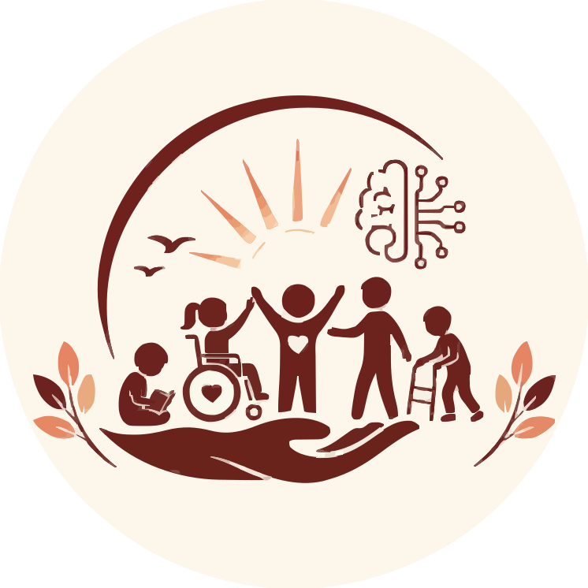
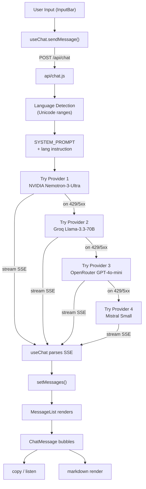

<div align="center">

  

  <h1>Kiran — AI Helpline</h1>

  <p><strong>A warm, accessible AI chatbot for Mrinaljyoti Rehabilitation Centre (MRC)</strong><br/>
  Supporting families of children with disabilities in Northeast India — in English, Hindi & Assamese.</p>

  <p>
    
    
    
    
    
  </p>

  <p>
    
    
    
  </p>

  <br/>

  <p>
    <a href="#-demo">🚀 Live Demo</a> · 
    <a href="https://github.com/ShravanDeb/kiran-chatbot/issues">🐛 Report Bug</a> · 
    <a href="https://github.com/ShravanDeb/kiran-chatbot/issues/new/choose">✨ Request Feature</a>
  </p>

</div>

---

## 🎬 Demo

<div align="center">
  
  
</div>
<div align="center">
  
  
</div>
<div align="center">
  
</div>

---

## 📋 Table of Contents

<details>
<summary>Click to expand</summary>

- [✨ Features](#-features)
- [🛠️ Tech Stack](#️-tech-stack)
- [🚀 Quick Start](#-quick-start)
- [⚙️ Installation](#️-installation)
- [🔧 Configuration](#-configuration)
- [📖 Usage](#-usage)
- [🏗️ Architecture](#️-architecture)
- [🧪 Testing](#-testing)
- [🚢 Deployment](#-deployment)
- [🤝 Contributing](#-contributing)
- [📜 License](#-license)

</details>

---

## ✨ Features

| Feature | Description |
|---------|-------------|
| 🌐 **Trilingual Support** | English, Hindi (Devanagari), Assamese (Assamese script) — auto-detected from user input via Unicode ranges, with manual pill toggle override |
| 👧 **Kiran Persona** | Warm, curious 8–10 year old girl who calls MRC staff "aunties and uncles"; short sentences (3–6), asks questions back, never diagnoses |
| 🤖 **4-Provider AI Fallback** | NVIDIA Nemotron-3-Ultra → Groq Llama-3.3-70B → OpenRouter GPT-4o-mini → Mistral Small; automatic retry on rate limits/errors |
| 🌊 **Streaming SSE Responses** | Token-by-token streaming via Server-Sent Events; "Kiran is thinking" animation with minimum 1.2s display for perceived responsiveness |
| 🎨 **Glassmorphism Design** | Warm cream/ink palette (`#F7F2EA` / `#2A1F1A`), maroon accent (`#7A2433`), `backdrop-filter` blur surfaces on header, input bar, chips, cards |
| 🌙 **Dark Mode** | Near-black `#0C0809` with subtle maroon radial glow; frosted dark glass cards; persisted via `localStorage` (`kiran-theme`) |
| 🔆 **High Contrast Overlay** | Independent of theme — pure black/white, 2px borders, no blur/shadow; `html.high-contrast` class, persisted (`kiran-high-contrast`) |
| 🔠 **Font Scaling** | Three sizes: 15px / 18px / 21px; sets `document.documentElement.style.fontSize` (all CSS in `rem`), persisted (`kiran-font-size`) |
| 🗣️ **Speech I/O** | TTS: Web Speech API with Neural voice preference (EN/HI only, Assamese disabled). STT: Continuous recognition (`en-IN`, `hi-IN`, `as-IN`) |
| 🛡️ **Rate Limiting** | Per-IP sliding window: 10 requests/minute; in-memory `Map` with 5-min cleanup; returns `429 { limitReached: true }` |
| ♿ **Full Accessibility** | Skip link, ARIA roles on pills/buttons, focus-visible outlines, `prefers-reduced-motion`, touch targets ≥44px on mobile |
| 📱 **Responsive & Mobile-First** | Breakpoints at 767px, 639px, 419px; hide tagline, shrink title, collapse utility icons progressively |

---

## 🛠️ Tech Stack

**Frontend**


**Backend / AI**


**DevOps & Quality**


---

## 🚀 Quick Start

```bash
# 1. Clone the repository
git clone https://github.com/ShravanDeb/kiran-chatbot.git
cd kiran-chatbot

# 2. Install dependencies
npm install

# 3. Create environment file (see Configuration)
cp .env.example .env.local
# Add your API keys to .env.local

# 4. Start development server
npm run dev
```

Open **http://localhost:5173** in your browser.

---

## ⚙️ Installation

### Prerequisites

| Tool | Version | Source |
|------|---------|--------|
| **Node.js** | 20+ | [nodejs.org](https://nodejs.org/) |
| **npm** | 10+ | bundled with Node |
| **API Keys** | — | See below |

### Required API Keys

Create `.env.local` in the project root:

```env
# NVIDIA Nemotron-3-Ultra (primary)
NVIDIA_API_KEY=your_nvidia_key

# Groq Llama-3.3-70B (fallback 1)
GROQ_API_KEY=your_groq_key

# OpenRouter GPT-4o-mini (fallback 2)
OPENROUTER_API_KEY=your_openrouter_key

# Mistral Small (fallback 3)
MISTRAL_API_KEY=your_mistral_key
```

> **Get keys from:** [NVIDIA NGC](https://ngc.nvidia.com/), [Groq Console](https://console.groq.com/), [OpenRouter](https://openrouter.ai/keys), [Mistral Console](https://console.mistral.ai/)

---

## 🔧 Configuration

### Vite Config (`vite.config.js`)

- **Dev proxy** for `/api/chat` → local Vercel function handler
- **Env loading** without `VITE_` prefix (all keys loaded via `loadEnv(mode, cwd, '')`)
- **Tailwind CSS v4** via `@tailwindcss/vite` plugin

### Tailwind CSS v4 (`src/index.css`)

Design tokens defined in `:root`:
```css
:root {
  --color-maroon: #7A2433;
  --color-cream: #F7F2EA;
  --font-latin: 'Nunito', sans-serif;
  --font-hindi: 'Baloo 2', sans-serif;
  --font-assamese: 'Baloo Da 2', sans-serif;
  /* ...glassmorphism tokens... */
}
```

### Language Detection

Auto-detects script from user message:
- **Devanagari** (`\u0900-\u097F`) → Hindi
- **Assamese** (`\u0980-\u09FF`) → Assamese
- Otherwise → English

Manual override via header pill buttons persists for session.

---

## 📖 Usage

### Starting a Conversation

1. Open the app
2. Type a question in **English**, **हिंदी**, or **অসমীয়া**
3. Press **Enter** or click **Send**
4. Kiran responds in the same language

### Header Controls (left → right)

| Control | Action |
|---------|--------|
| `+` button | New chat (clears history) |
| **Language pills** | EN / हिंदी / অসমীয়া — manual override |
| **T** button | Cycle font size: Normal → Large → Extra Large |
| **Contrast** (circle) | Toggle high-contrast overlay |
| **Sun/Moon** | Toggle dark/light mode |

### Message Actions

- **Copy** — copies assistant message to clipboard
- **Listen** — reads message aloud (EN/HI only, Neural voice)

### Suggested Chips

Before first message, chips appear for common questions:
- "What is Cerebral Palsy?"
- "My child isn't speaking yet"
- "Is there a fee for services?"
- "How do I enroll my child?"
- "What are signs of Autism?"
- "People say I should hide my child"

Clicking a chip sends it instantly. Chips filter by detected input language.

---

## 🏗️ Architecture

```
kiran-chatbot/
├── api/
│   └── chat.js              # Vercel serverless function — 4-provider streaming SSE
├── public/
│   └── logo.svg             # Favicon & welcome avatar
├── src/
│   ├── components/
│   │   ├── Header.jsx       # Navbar: logo, language, a11y controls
│   │   ├── MessageList.jsx  # Virtualized list, welcome card, thinking animation
│   │   ├── ChatMessage.jsx  # Bubbles, copy/listen actions, provider badge
│   │   ├── InputBar.jsx     # Glassmorphism textarea, mic, send
│   │   ├── SuggestedChips.jsx # Horizontal scroll, language-filtered
│   │   └── KiranThinking.jsx # Two-phase animation: text → pulsing dots + lotus
│   ├── hooks/
│   │   ├── useChat.js       # SSE streaming, abort, 1.2s min thinking timer
│   │   ├── useTheme.js      # Dark mode via data-theme attr + localStorage
│   │   ├── useAccessibility.js # High-contrast + font-size (3 steps)
│   │   └── useSpeech.js     # Web Speech API: TTS (EN/HI) + STT (EN/HI/AS)
│   ├── utils/
│   │   └── i18n.js          # Dictionary-based i18n (EN/HI/AS)
│   ├── App.jsx              # Composes Header, MessageList, InputBar, Chips
│   ├── main.jsx             # React 19 entry point
│   └── index.css            # 1300+ lines: tokens, dark, HC, responsive, animations
├── index.html               # Meta, fonts, favicon
├── vercel.json              # SPA rewrite + /api/* proxy
├── vite.config.js           # Dev proxy, env loading, Tailwind plugin
└── package.json
```

### Data Flow



### Rate Limiting

```js
// api/chat.js — in-memory sliding window
const RATE_LIMIT_WINDOW_MS = 60_000; // 1 minute
const RATE_LIMIT_MAX = 10;            // requests per window per IP
// Cleanup every 5 minutes
```

---

## 🧪 Testing

No test suite is configured yet. Recommended additions:

```bash
# Unit / Component
npm add -D vitest @testing-library/react @testing-library/jest-dom jsdom

# E2E
npm add -D playwright
```

Suggested test targets:
- `useChat` SSE parsing & error handling
- `i18n.t()` fallback behavior
- Theme/HC/font persistence round-trips
- Language detection regexes

---

## 🚢 Deployment

### Vercel (Recommended)

1. Push to GitHub
2. Import project in Vercel
3. Add Environment Variables (same as `.env.local`)
4. Deploy — `vercel.json` handles:
   - `/api/*` → serverless functions
   - SPA fallback to `index.html`

### Build Command

```bash
npm run build
# Output: dist/
```

### Preview Production Build Locally

```bash
npm run preview
```

---

## 🗺️ Roadmap

- [x] 4-provider AI fallback with automatic retry
- [x] Trilingual support (English / Hindi / Assamese)
- [x] Streaming SSE responses with thinking animation
- [x] Glassmorphism UI with dark mode and high contrast
- [x] Speech I/O (TTS + STT)
- [ ] Test suite (Vitest + Playwright)
- [ ] PWA / offline support
- [ ] Conversation history persistence
- [ ] Assamese TTS (Web Speech API currently unsupported)
- [ ] Admin dashboard for MRC staff

---

## 🤝 Contributing

1. Fork the repository
2. Create a feature branch: `git checkout -b feat/amazing-feature`
3. Run lint: `npm run lint` (oxlint)
4. Commit with conventional messages: `git commit -m 'feat: add amazing feature'`
5. Push and open a Pull Request

### Code Style

- **oxlint** for fast linting (React hooks, exports)
- **Tailwind CSS v4** utility-first styling
- **CSS custom properties** for theming (no JS-in-CSS)
- **Functional components** + hooks only

---

## 📜 License

Distributed under the **MIT License**. See `LICENSE` for more information.

---

<div align="center">

**Built with ❤️ for the families of Northeast India**

*Because every child is special.*

</div>